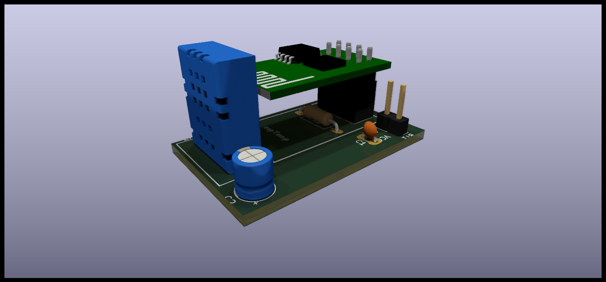
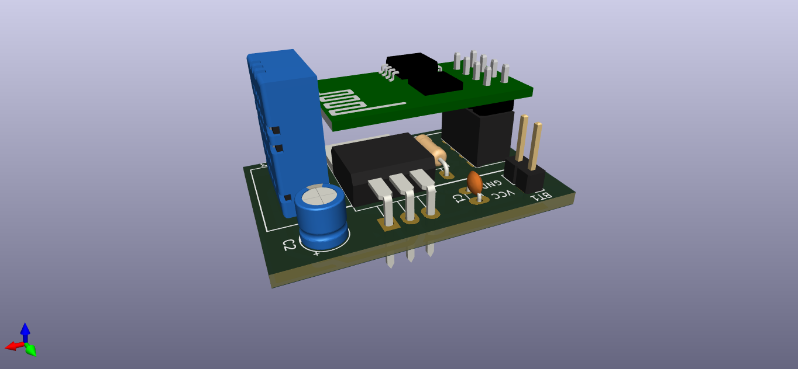
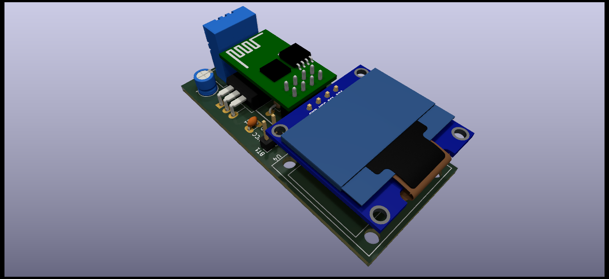

# espTemp

An ESP-01 module with a DHT22 temperature sensor  
KiCad/espTemp/espTemp.png
Modified from [https://randomnerdtutorials.com/esp8266-dht11dht22-temperature-and-humidity-web-server-with-arduino-ide/](https://randomnerdtutorials.com/esp8266-dht11dht22-temperature-and-humidity-web-server-with-arduino-ide/)

## Hardware

Build according to schematics in KiCAD.  

## Software

Copy file wifiConfig.h.template in espTemp-PIO/src to wifiConfig.h.  
>$ cp espTemp-PIO/src/wifiConfig.h.template espTemp-PIO/src/wifiConfig.h

Edit the new file, entering your SSID and password.  
Compile and upload.  

Connect via serial (while module is still in  programmer) to find out IP and port.  

## Pins on the ESP-01

Pin         Input       Output  
5   GPIO0   pulled up   OK          connected to FLASH button, boot fails if pulled LOW  
2   GPIO1   TX pin      OK          HIGH at boot, debug output at boot, boot fails if pulled LOW  
3   GPIO2   pulled up   OK          HIGH at boot, connected to on-board LED, boot fails if pulled LOW  
7   GPIO3   OK          RX pin      HIGH at boot  
